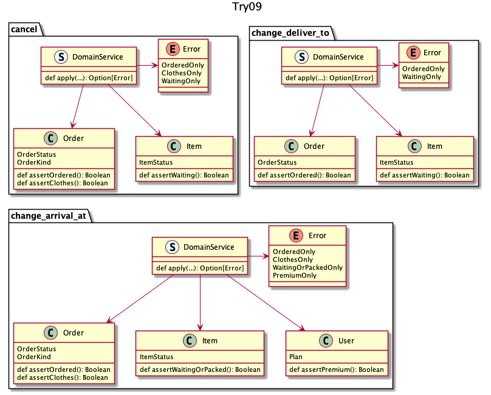

## try 09
それぞれの UC が独立して別の都合でルールが変わりそうなので完全に分離しよう、という発送

エラーの一覧 | プロダクトとしてのエラーの統一感 | 再利用   | 判定責務   
:--          | :--                              | :--      | :--        
明瞭         | レビュー頼り                     | できない | UC 最低限分

:thinking: ここまで類似コードになるなら、実際のところは類似の仕様変更が起きそうなので、過度な疎結合という印象...

