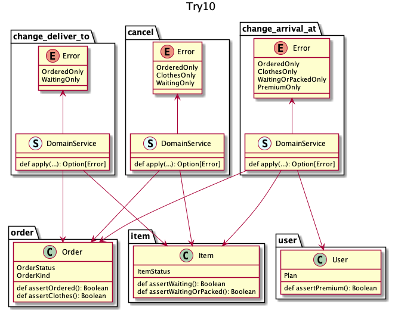

## try 10
何についてチェックするかはせいぜい数パターンなので汎用的に用意しておこう、ただしエラーの一覧だけはまとめておこう、という発想

エラーの一覧 | プロダクトとしてのエラーの統一感 | 再利用 | 判定責務
:--          | :--                              | :--    | :--     
明瞭         | レビュー頼り                     | できる | 全 UC 分

:thinking: 一番コード量とエラーの一覧の折り合いが一番良さそう

