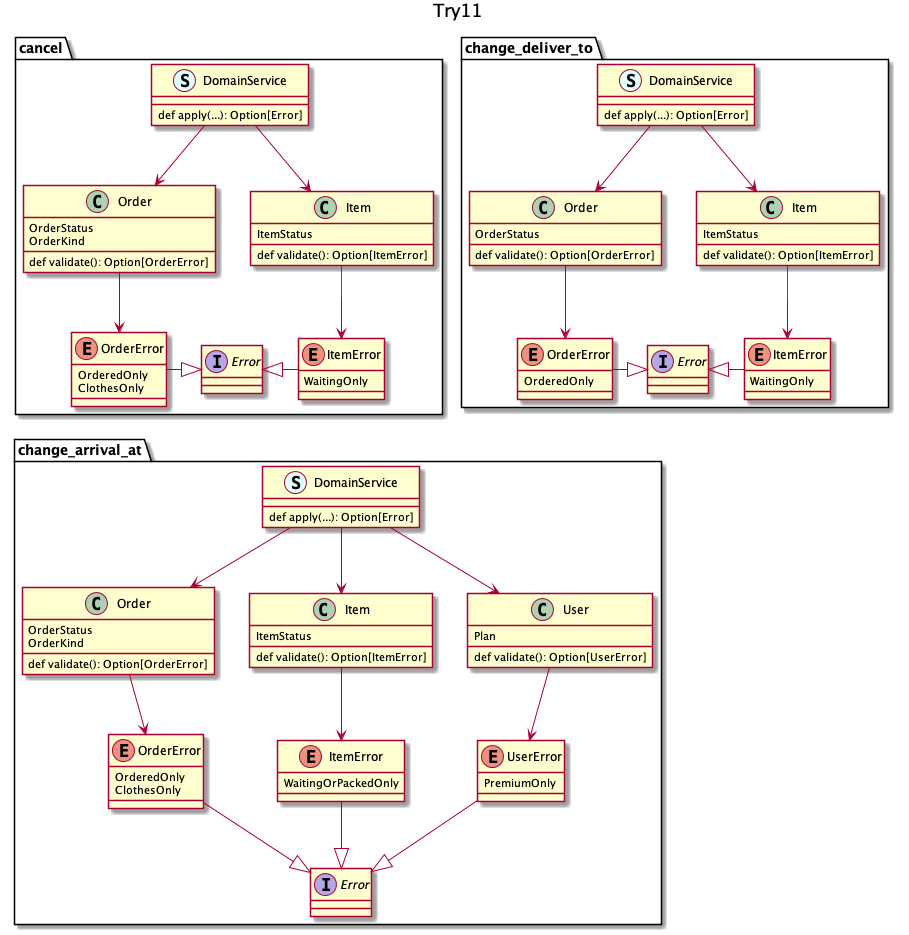

## try 11
それぞれを完全に分離して、かつ`DomainService`のコードを`Order`に移譲しよう、という発想

エラーの一覧     | プロダクトとしてのエラーの統一感 | 再利用   | 判定責務   
:--              | :--                              | :--      | :--        
合算すればわかる | レビュー頼り                     | できない | UC 最低限分

:thinking: お互い一切影響せず再利用もできないのに、この移譲はやりすぎ間

