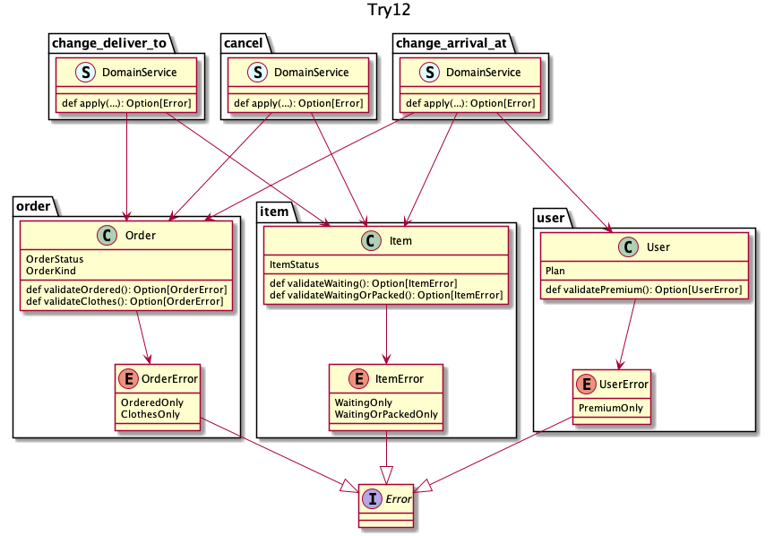

## try 12
移譲するならエラーまで任せれば良いじゃん、という発想

エラーの一覧 | プロダクトとしてのエラーの統一感 | 再利用 | 判定責務
:--          | :--                              | :--    | :--     
絵では不明   | 統一しやすい                     | できる | 全 UC 分

:thinking: 一番コード量を少なくでき、`DomainService`を増やすのも組み合わせですぐ実現できそう

