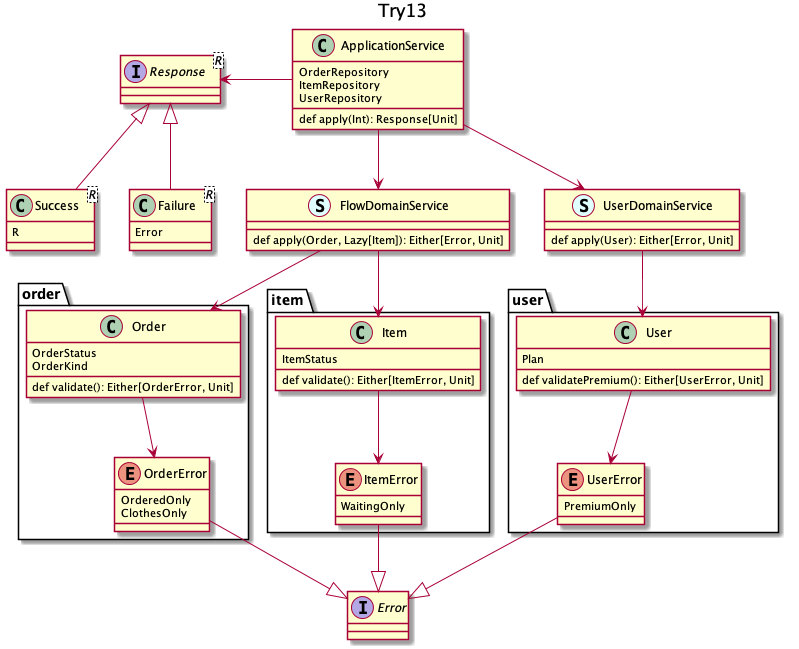

## try 13
`Lazy`に決め、エラーの一覧は合算すればわかる程度の移譲にしよう、という発想  

+ 各所を`Option[Error]`から`Either[Error, Unit]`にすることで、処理を組み合わせやすく、また途中で中断しやすくしている
  + `Order`と`Item`を、また`FlowDomainService`と`UserDomainService`を組み合わせている
+ 最後に`Either`の左右両方を`Response`にしてしまう
+ テストは面倒なので`Main`で動作確認
  + `Item`の参照が遅延されている
  + `User`の参照は`Lazy`ではないが必要になるまでされない
  + 全ての判定が通ると`cancel()`が実行される

